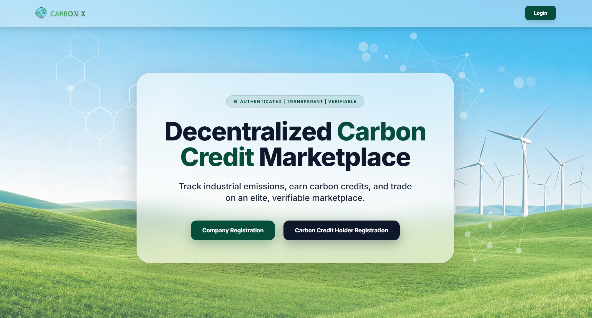
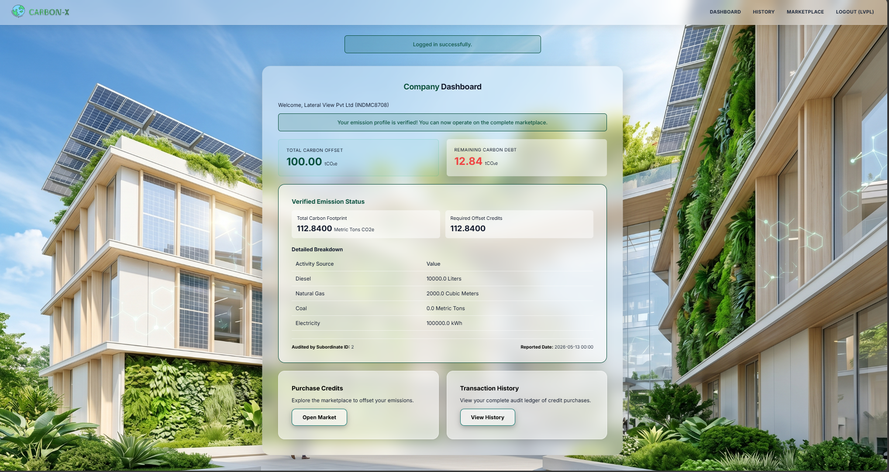
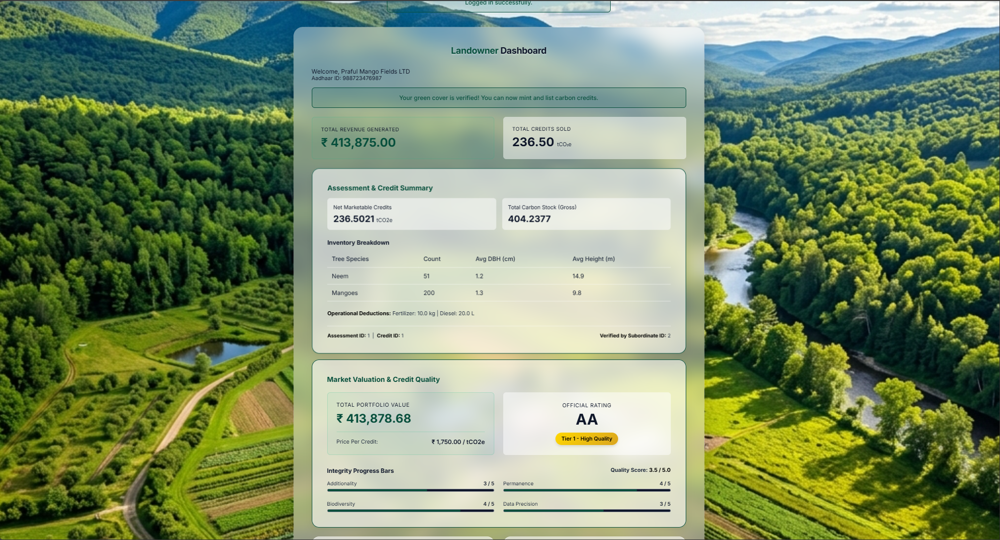
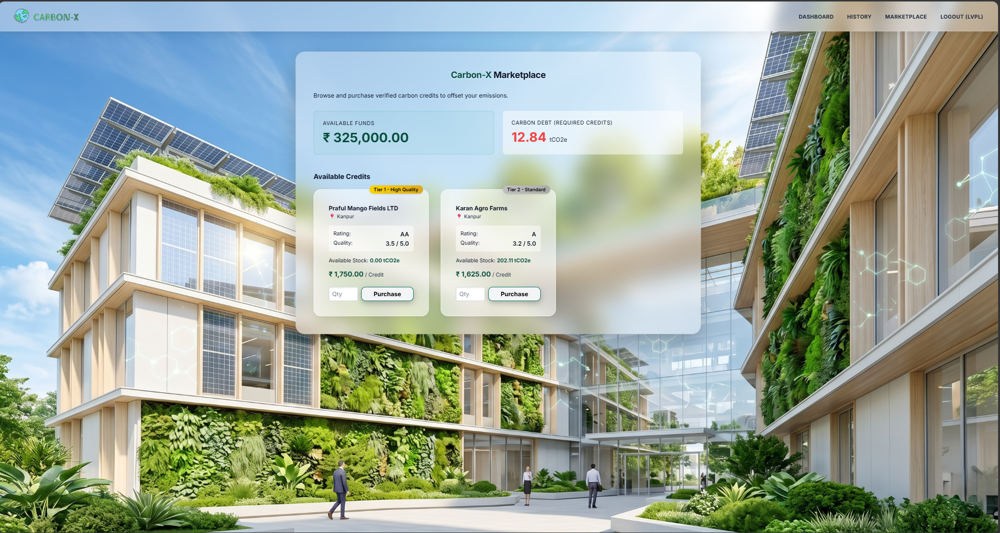

# CarbonX: Decentralized Carbon Credit Marketplace 🌍🌱

Overview

CarbonX is a scalable, decentralized ecosystem designed to bridge the gap between verified green-cover landowners and enterprise companies striving for carbon neutrality. Built with a modular Flask backend, this platform automates the end-to-end lifecycle of carbon offsetting: from on-site biomass verification and algorithmic credit generation to secure marketplace transactions and cryptographic certificate issuance.

🌟 Key Technical Highlights

Advanced Algorithmic Processing: * Carbon Sequestration Engine: Implements Above Ground Biomass (AGB) calculations utilizing specific wood density mappings (ρ), Diameter at Breast Height (DBH), and tree height to accurately compute gross/net tCO2e.

Emission Calculator: Converts Scope 1 & 2 activity data (diesel, electricity, gas, coal) directly into Metric Tons CO2e requirements.

Complex Role-Based Access Control (RBAC): Manages a 4-tier user architecture (System Admin, Field Subordinate, Enterprise Company, Landowner) with heavily encapsulated state management.

Snapshot Audit Ledger: Transactions use point-in-time snapshotting (seller_old_credit_balance, buyer_new_wallet_balance) within the CarbonTransaction model to ensure financial integrity and prevent race-condition data loss during credit retirement.

Cryptographic Verification: Generates unique, mathematically verifiable Carbon Neutrality Certificates using SHA-256 hashing.

🏗️ System Architecture & Workflows

1. Administrative Control Module (admin)

Allocates verification tasks to field subordinates.

Maintains global oversight of unassigned corporate emission audits and landowner site verifications.

Ultimate authority on task rejection overrides and platform-wide user authorization.

2. Field Verification Engine (subordinate)

Acts as the trust layer of the marketplace.

For Companies: Submits verified operational metrics (kWh, liters, metric tons) to auto-generate emission reports.

For Landowners: Inputs raw forestry data to trigger the platform's Carbon Assessment engine. Implements a 4-point Integrity Audit (Additionality, Permanence, Biodiversity, Precision) to algorithmically assign Market Tiers (Tier 1 Premium to Tier 3 Budget) and dynamic pricing.

3. The Marketplace (company & landowner)

Supply Side (Landowners): Automatically lists dynamically priced, verified carbon credits to the active market. Tracks real-time wallet balances and credit depletion.

Demand Side (Companies): Features a secure trading portal. Companies purchase fractional or bulk credits to offset their calculated emissions.

Retirement Engine: Once Required_credits hit 0.0, the system automatically issues a verifiable SHA-256 Carbon Neutral certificate.

🖥️ System Interfaces

### Homepage 

*Home Page*

### Enterprise Dashboard

*Real-time emission tracking and wallet balance interface.*

### Landowner Dashboard

*Real-time Protfolio and Revenue generated.*

### MarketPlace

*Real-time Market Place .*

### Demo At (https://drive.google.com/file/d/1oZzV4lRrp_2l-ER2pZVaJeUFPROAVDMm/view?usp=drive_link)
🛠️ Tech Stack & Database Schema

Backend: Python, Flask (Factory Pattern & Blueprints)

Database & ORM: SQLAlchemy (Configured for dynamic SQLite/PostgreSQL deployment)

Security: Flask-Login, Werkzeug Security (Bcrypt hashing), SHA-256

Database Models: 9 heavily normalized interconnected tables:

User, CompanyProfile, LandownerProfile, SubordinateProfile

VerificationTask, CarbonAssessment, EmissionReport

CarbonCredit, CarbonTransaction (Ledger)

🚀 Local Setup & Installation

1. Clone the repository

git clone [https://github.com/AMRITANSHU-SINGH1/CARBON-X.git](https://github.com/AMRITANSHU-SINGH1/CARBON-X.git)
cd CarbonX

2. Create and activate a virtual environment

# Windows
python -m venv venv
venv\Scripts\activate

# macOS/Linux
python3 -m venv venv
source venv/bin/activate

3. Install dependencies
(Assuming a requirements.txt is present in the repository)

pip install -r requirements.txt

Alternatively, install core packages directly:
pip install Flask Flask-SQLAlchemy Flask-Login python-dotenv

4. Initialize the Database & Super Admin

python init_db.py

This generates the schema and provisions the master admin (admin / admin123).

5. Launch the Application

python app.py

The ecosystem will be live at http://127.0.0.1:5000

🔮 Future Architecture Roadmap

PostgreSQL Migration: Full transition to PostgreSQL utilizing advanced indexing for high-frequency marketplace trading.

Blockchain Ledger: Transition the CarbonTransaction snapshot ledger to an immutable Web3 smart contract to ensure 100% public verifiability of credit retirement.

Geospatial API Integration: Integrate satellite imaging APIs to automate preliminary green-cover validation before deploying field subordinates.