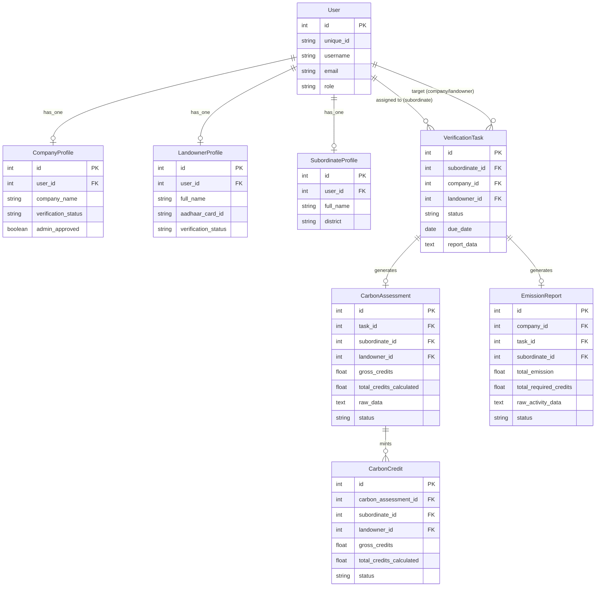

# Carbon-X Project Status Overview

## 1. Overall Status of the Project
The project has evolved into a robust, decentralized carbon management and marketplace platform. It features a complete Role-Based Access Control (RBAC) system with dedicated workflows for four primary roles: **Admin, Subordinate, Company, and Landowner**.

The foundational verification system is fully functional:
- **Authentication & Profiles:** Users can register and maintain role-specific profiles. Subordinates are managed directly by Admins.
- **Task Allocation System:** Admins can allocate pending verification tasks (for newly registered Companies and Landowners) to Subordinates.
- **Subordinate Processing Engine:**
  - **Landowners:** Subordinates conduct on-site physical verifications, input tree inventory data, and automatically calculate Gross and Net Carbon Credits.
  - **Companies:** Subordinates record Scope 1 (Direct) and Scope 2 (Indirect) emissions, automatically calculating the company's total emissions and required carbon credits.
- **State Management:** Once verifications are processed, the clients (Companies/Landowners) are automatically marked as `approved`, giving them full access to their respective dashboards.

---

## 2. Present ER Diagram (Entity-Relationship)

The following diagram outlines the database schema and how each entity relates to one another via SQLAlchemy.

---

## 3. Core Project Workflow

The core functionality of Carbon-X relies on an airtight verification pipeline before clients can trade or offset credits.

### A. Onboarding & Registration
1. A **Company** or **Landowner** registers on the platform.
2. Upon registration, their `verification_status` is set to `pending`. They cannot access the core marketplace or trading features until verified.
3. They submit a preliminary verification request, changing their status to `submitted`.

### B. Task Allocation
1. The **Admin** monitors the "Allocations" dashboard, which lists all unassigned `submitted` clients.
2. The Admin selects a client (Company or Landowner) and assigns them to a **Subordinate** by creating a `VerificationTask`.
3. The task appears in the Subordinate's queue with an `assigned` status.

### C. On-Site Processing (The Subordinate Engine)
The Subordinate travels to the client's site and clicks "Process" on the allocated task. The workflow diverges based on the client type:

#### For a Company (Emission Tracking):
1. Subordinate opens the **Emission Investigation Report**.
2. Inputs **Scope 1** (Diesel, Natural Gas, Coal) and **Scope 2** (Electricity) activity data.
3. The system dynamically calculates the `Total Emission` and `Required Credits`.
4. An `EmissionReport` record is created.

#### For a Landowner (Credit Minting):
1. Subordinate opens the **Carbon Assessment Form**.
2. Inputs tree inventory (Species, DBH, Height) and operational deductions (Fertilizer, Diesel).
3. The system calculates Gross Carbon Stock and Net Marketable Credits.
4. A `CarbonAssessment` record is created, and matching `CarbonCredit` records are minted in the database.

### D. Approval & Access
1. Once the Subordinate submits the form, the `VerificationTask` status changes to `completed`.
2. The client's profile (`CompanyProfile` or `LandownerProfile`) is automatically updated to `approved`.
3. The Company or Landowner can now log in, view their verified data (emissions or minted credits), and participate in the decentralized carbon marketplace.
